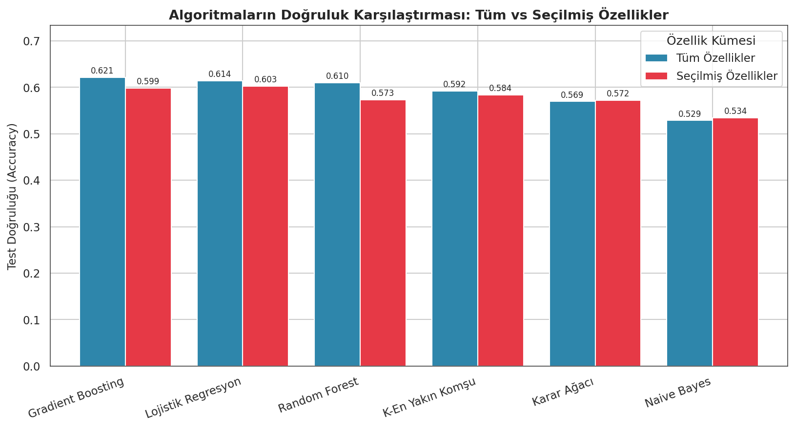
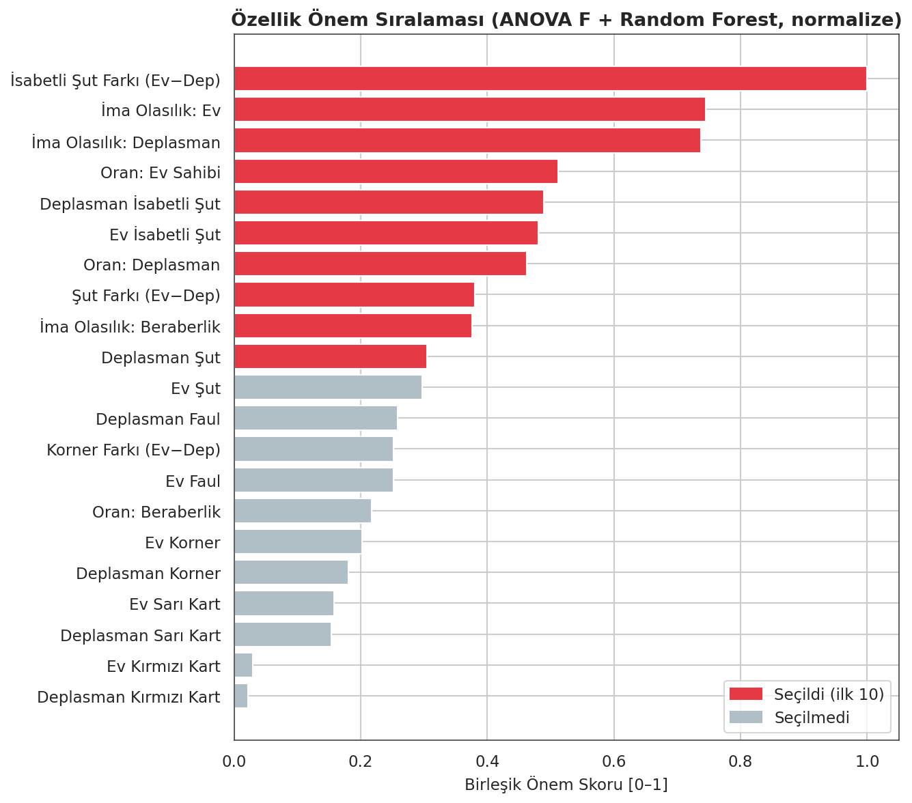
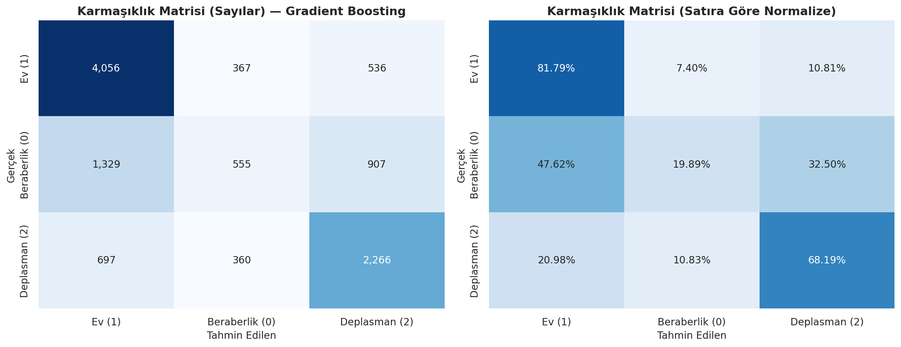

# ⚽ European Football Match Outcome Prediction

Predicting the outcome of European football matches — **Home Win / Draw / Away Win** —
from betting odds and in-match team statistics, using machine learning.


> **YMH340 — Data Mining** term project · Ankara University, Department of Software Engineering
> *(Course report and in-code documentation are written in Turkish.)*

A complete, reproducible data-mining pipeline: from a raw, messy 14 MB dataset of
**102,815 matches across 25 leagues (2000–2026)** to a comparative evaluation of
six classification algorithms with full data cleaning, feature engineering, and
feature selection.

---

## 🎯 Key Results

| Metric | Value |
|--------|-------|
| Modeling dataset | **55,362 matches × 21 features** (complete-case) |
| Majority-class baseline | 44.78 % |
| **Best model** | **Gradient Boosting — 62.11 % accuracy** |
| Algorithms compared | Decision Tree, Random Forest, Naive Bayes, Logistic Regression, KNN, Gradient Boosting |

All six models beat the baseline. The most predictive features are the **shots-on-target
difference** and the **implied probabilities derived from betting odds** — while the
**draw** class is by far the hardest to predict (a finding consistent with the literature).

#### Model comparison — all vs. selected features


#### Feature importance (ANOVA F-test + Random Forest)


#### Confusion matrix of the best model


*(Figure labels are in Turkish: "Ev" = Home, "Beraberlik" = Draw, "Deplasman" = Away.)*

---

## 📁 Project Structure

```
european-football-match-prediction/
├── data/
│   └── EUROPEAN_FOOTBALL_DATABASE_FULL.csv   # Raw dataset (102,815 × 28)
├── src/                                      # Modular source code
│   ├── config.py                             # Paths, constants, feature lists
│   ├── data_loading.py                       # Loading & summarizing
│   ├── preprocessing.py                      # Target, cleaning, feature engineering
│   ├── eda.py                                # Exploratory data analysis figures
│   ├── feature_selection.py                  # ANOVA F + Random Forest selection
│   ├── modeling.py                           # Training & evaluation
│   └── visualization.py                      # Shared plotting helpers
├── outputs/
│   ├── figures/                              # 9 generated figures (.png)
│   └── tables/                               # Result tables (.csv / .md)
├── report/
│   ├── generate_report.py                    # Builds the final Word report
│   ├── YMH340_Proje_Raporu.docx              # Final report (Turkish)
│   └── YMH340_Proje_Raporu.pdf
├── docs/                                     # Course brief & project proposal
├── main.py                                   # Runs the full pipeline
├── requirements.txt
└── README.md
```

---

## ⚙️ Installation & Usage

```bash
# 1) Install dependencies
pip install -r requirements.txt

# 2) Run the full data-mining pipeline
python main.py

# 3) (Optional) Regenerate the Word report from current outputs
python report/generate_report.py
```

`main.py` runs end-to-end: data loading → EDA → cleaning & feature engineering →
feature selection → training/evaluation of 6 algorithms on both **all** and
**selected** features. All figures, tables and the trained model are written to `outputs/`.

---

## 🔬 Methodology

- **Task** — Supervised multi-class classification (3 classes). The target
  `result` is derived by comparing home vs. away goals (`1` Home, `0` Draw, `2` Away).
- **Leakage prevention** — The goal columns that *define* the target (and half-time
  goals) are never used as features.
- **Missing data** — ~46 % of rows lack full match statistics; columns with extreme
  missingness (referee, over/under odds) are dropped, and a complete-case subset of
  ~55K matches is used.
- **Feature engineering** — Normalized implied probabilities from odds (removing the
  bookmaker margin) and home−away difference features (shots, shots on target, corners).
- **Feature selection** — Combined ranking from an ANOVA F-test and Random Forest
  importances; top 10 features retained.
- **Evaluation** — Stratified 80/20 split + 5-fold cross-validation; accuracy and
  macro-F1. Reproducible via a fixed `random_state = 42`.

---

## 📊 Dataset

The *European Football Database* (`data/EUROPEAN_FOOTBALL_DATABASE_FULL.csv`) was
compiled by the team from public domestic-league archives and Wikipedia match records.
It contains 102,815 matches and 28 columns spanning 25 leagues and 26 seasons,
including goals, betting odds, and detailed match statistics (shots, corners, fouls,
cards). The file size and column count made desktop tools (WEKA/Orange) impractical,
which is why the analysis was implemented in Python.

---

## 👥 Team

| # | Name | Role |
|---|------|------|
| 1 | **Ata Sakık** | Data preprocessing & cleaning, target derivation |
| 2 | **Taha Furkan Tosun** | Feature selection & correlation analysis |
| 3 | **Yunus Emre Arslan** | Model setup & training |

---

## 📄 License

Released under the [MIT License](LICENSE).

---

<details>
<summary>🇹🇷 Türkçe Özet</summary>

Bu proje, Avrupa'nın 25 farklı liginde oynanmış ~102.000 maça ait veriyi, iddia
oranlarını ve maç istatistiklerini kullanarak maç sonucunu (Ev Sahibi Galibiyeti /
Beraberlik / Deplasman Galibiyeti) tahmin eden bir **çok sınıflı sınıflandırma**
çalışmasıdır. Tüm hat Python ile kurulmuştur (`python main.py`). 6 algoritma tüm ve
seçilmiş özelliklerle karşılaştırılmış; en iyi sonucu **Gradient Boosting %62,11**
doğrulukla vermiştir. Detaylı Türkçe rapor `report/` klasöründedir.

</details>
